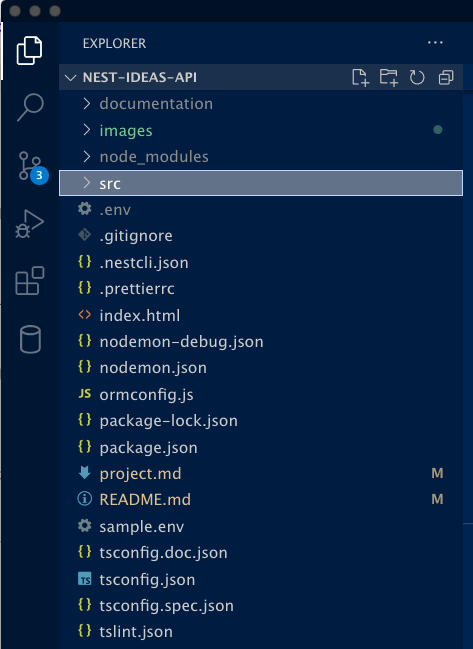
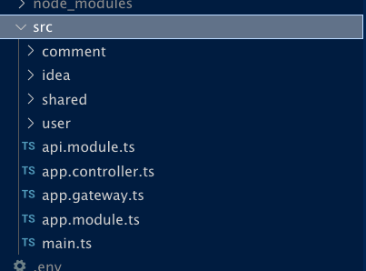
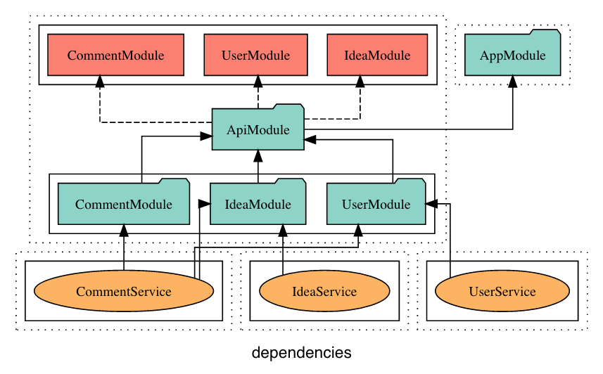
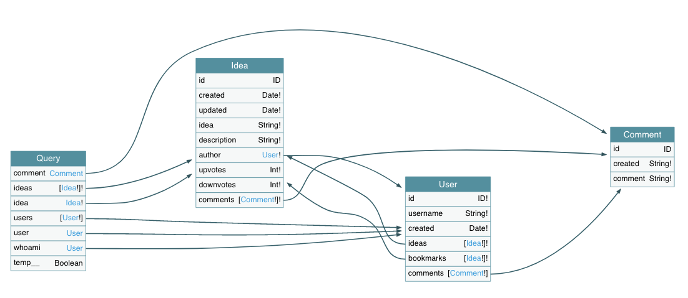

# App Ideas App

A place to see and post ideas in the style of reddit and twitter

## User Stories

- Authenticate users
- Users can CRUD ideas
- Users can upvote/downvote ideas
- Users can bookmark ideas
- Users can comment on ideas
- Ideas can be seen in realtime

## Stack

- Database - <span style="color:red">Changed</span> 
- REST API - NestJS
- GraphQL API - NestJS
- Rest Frontend - Angular with NGRX
- GraphQL Frontend - React (Native?) with Apollo Client


## Project Architecture

The overall architecture and induced dependencies are as follows:

Project Directory  



Source Directory




### Application Artifacts

The application (`App`) consists of three related domain objects: `Users`, `Ideas` and `Comments`.  
Each Domain Object has in its own module.  
Domain Objects are manipulated via module specific `Services`. 

## Project Directory Structure



# Entities and Their Relations



## How to obtain?

1. Start the app
2. Open <a href="http://localhost:8080/graphql">http://localhost:8080/graphql</a> in a browser to display the GraphQL Playground.  
`Playground` is a tool to visually explore the GraphQL objects of an application.  
3. Open a second browser tab
4. Open <a href="https://apis.guru/graphql-voyager">apis.guru/graphql-voyager</a>
5. Click on `Change Schema` button.
6. Switch to tab `Introspection`.
7. Click on `Copy Introspection Query`.
8. Paste then text into `GraphQL Playground`s Query field.
9. Run the query.
10. Copy the returned schema data.
11. Switch back to http://apis.guru/graphql-voyager and paste the returned schema into the text area. 
12. Clik `Display` button and wait a moment. You will see a graph displaying the relations between your entities.


# Changes to the Project

- Database: 
    use MySQL

- Environment
    - sample.env    added DATABASE_NAME='ideas'  REASON: MySQL needs this.

- Dependencies
    - installed
        - npm install --save reflect-metadata@0.1.12  
        REASON: *npm WARN @nestjs/typeorm@5.3.0 requires a peer of reflect-metadata@0.1.12 but none is installed.*
    
        - npm install --save mysql2  
        REASON: *using MySQL instead of PostGresQL*

- Code
    - Database
        - Columns
            - usename limited to 50 characters
                ```code
                 @Column({
                    unique: true,
                    length: 50
                })
                username: string;
                ```
                REASON  BLOB/TEXT column 'username' used in key specification without a key length +2ms
                QueryFailedError: BLOB/TEXT column 'username' used in key specification without a key length

- Tooling
    - Documentation / Visualization of Project Architecture
        - install: npm install -g @compodoc/compodoc 
        - running: compodoc -p tsconfig.doc.json -s
        - using: compodoc running on port xxxx http://localhost:XXXX   (8888)